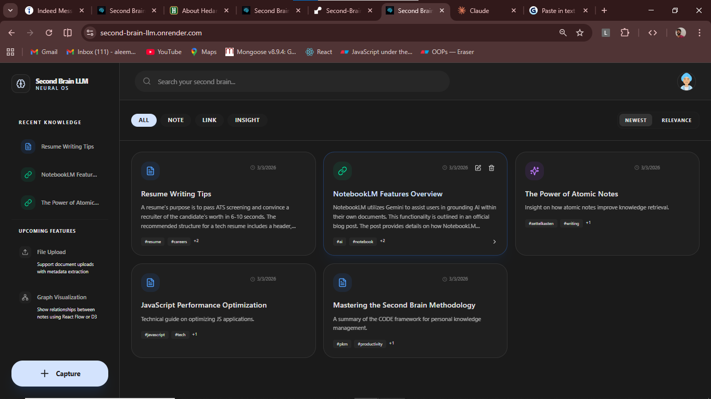
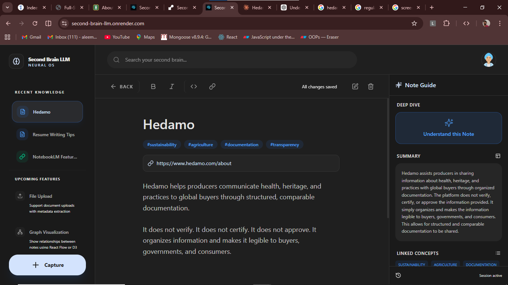
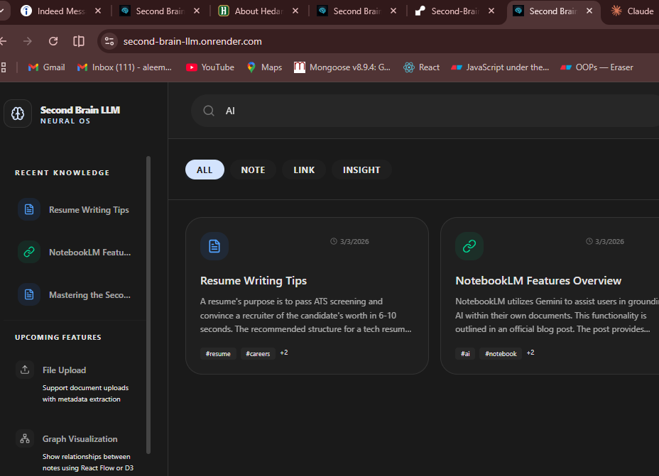
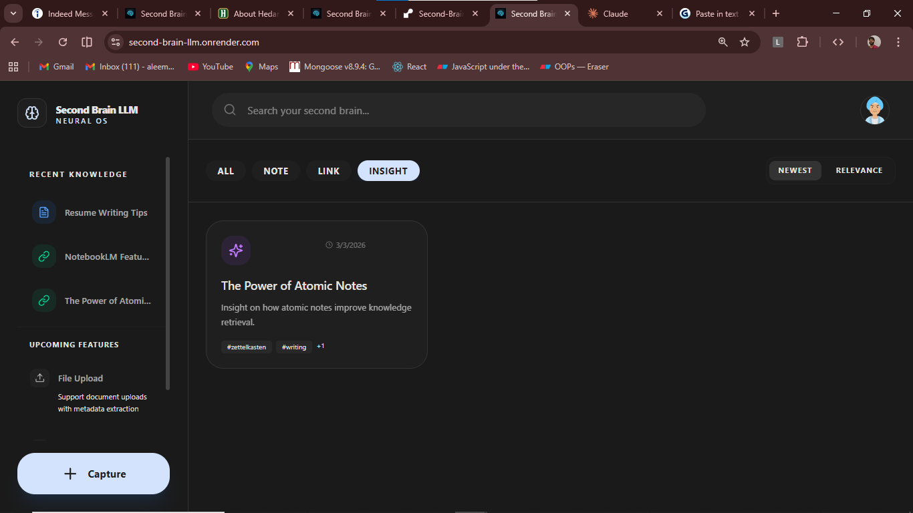
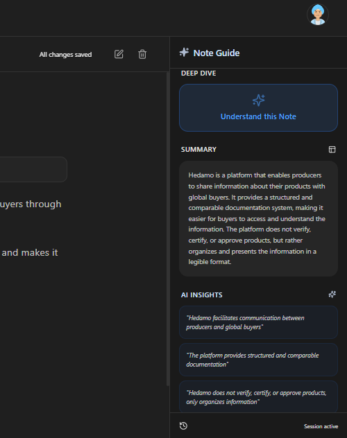
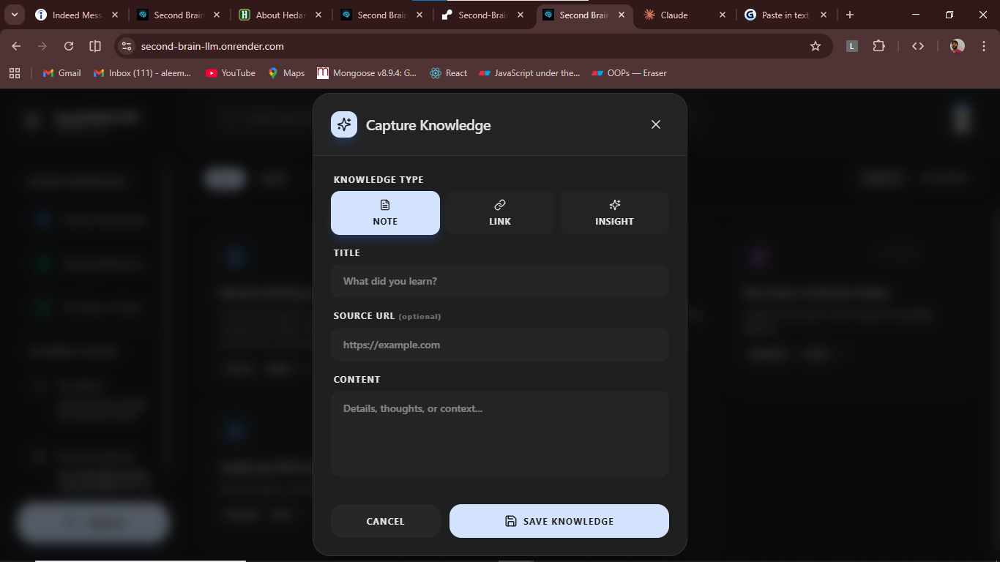

# Second Brain LLM &middot; Neural OS 🧠

A premium, AI-powered knowledge management system built with **Node.js (Express)**, **React (Vite)**, and **Groq (Llama 3.3)**. Research, capture, and interact with your personal knowledge through a high-performance LLM core.

---

## 📸 UI Screenshots

### 🖥️ 1. Main Dashboard
The neural control center. View all your knowledge items in a premium, organized grid.


### 📝 2. Interactive Workspace (Open Notes)
A distraction-free environment for deep work, writing, and editing your thoughts.


### 🔍 3. Intelligent Search
Instantly find any piece of information across your entire second brain.


### 🏷️ 4. Smart Filtering
Organize and slice your knowledge using dynamic category and tag filters.


### 🤖 5. AI Integration & Insights
Harness the power of Llama 3.3 to summarize content and extract key insights automatically.


### ⚡ 6. Knowledge Capture
Quickly save notes and links with auto-tagging and metadata extraction.


---

## 🚀 Quick Start

### 1. Prerequisites
- **Node.js**: v18+ 
- **MongoDB**: Local or Atlas instance
- **Groq API Key**: Get one at [groq.com](https://console.groq.com/keys)

### 2. Backend Setup
```bash
cd backend
npm install
# Copy and fill the environment variables
cp .env.example .env
# Start the server
npm run dev
```

### 3. Frontend Setup
```bash
cd frontend
npm install
npm run dev
```

---

## 🛠 Tech Stack
| Tier | Technology | Description |
|---|---|---|
| **Frontend** | React + Vite + Tailwind CSS | Modern, high-performance UI |
| **Animation**| Framer Motion | Premium micro-interactions & transitions |
| **Logic**    | Node.js + Express | Robust API-first architecture |
| **Database** | MongoDB + Mongoose | Flexible document storage |
| **AI Core**  | Groq SDK (Llama 3.3) | State-of-the-art LLM for processing |

---

## 🔑 Environment Variables

### Backend (`/backend/.env`)
Create a `.env` file in the backend directory:
```env
PORT=8000
MONGO_URI=mongodb://localhost:27017/second-brain
GROQ_API_KEY=your_groq_api_key_here
```

### Frontend (`/frontend/.env`)
The frontend uses standard Vite environment variables:
```env
VITE_API_URL=http://localhost:8000/api
```

---

## 🏗 Architecture Notes

The system is designed with a **three-layered architecture**:

### 1. The Interaction Layer (Frontend)
- **Dashboard Grid**: Visual overview of all knowledge with smart filters (Newest, Relevance).
- **Workspace**: A distraction-free editing environment with real-time auto-saving.
- **Micro-Interactions**: Pulse skeletons, staggered entry animations, and custom UI components ensure a "premium" feel.

### 2. The Logic Layer (Backend Controller)
- **Source Management**: CRUD operations for Notes, Links, and Insights.
- **AI Processing**: Automated tag generation and summarization triggered on creation/update.
- **Public API**: An external-facing query system that allows tools to search your brain.

### 3. The Neural OS Layer (AI Service)
- **Grounded Retrieval**: The system uses a RAG-inspired approach for queries, feeding your notes as context to the LLM.
- **Deep Dive**: An "Understand" feature that analyzes long-form content to extract core takeaways and related concepts.

---

## 🌐 Public API Reference

The Second Brain can be queried by external tools through the public endpoint:

**Endpoint**: `GET /api/public/brain/query?q=your-question`

**Response Format**:
```json
{
  "answer": "Concise AI-generated response based on your notes.",
  "sources": [
    { "id": "uuid", "title": "Source Title", "type": "Note" }
  ]
}
```

---

*Built with ❤️ for High-Performance Knowledge Work.*
